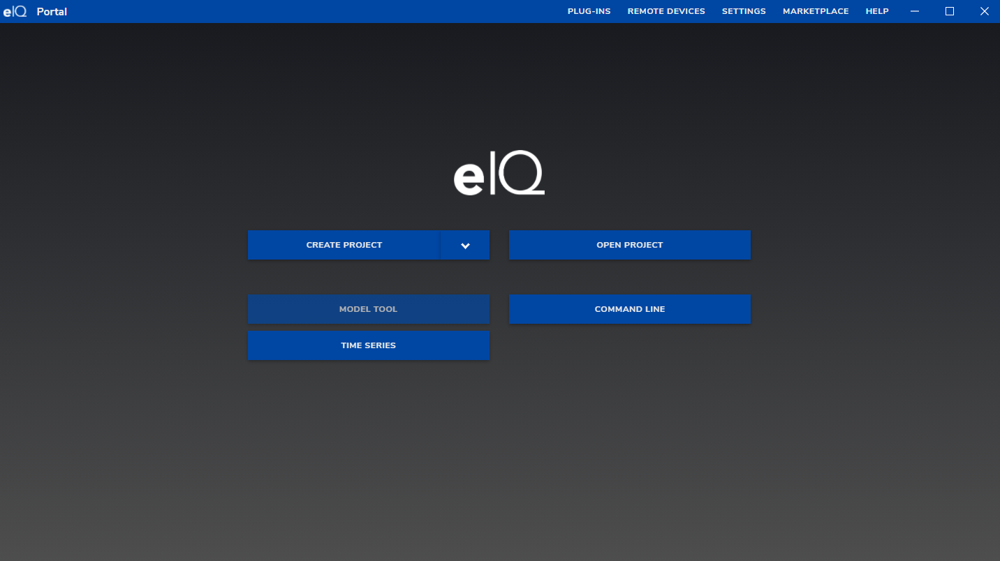
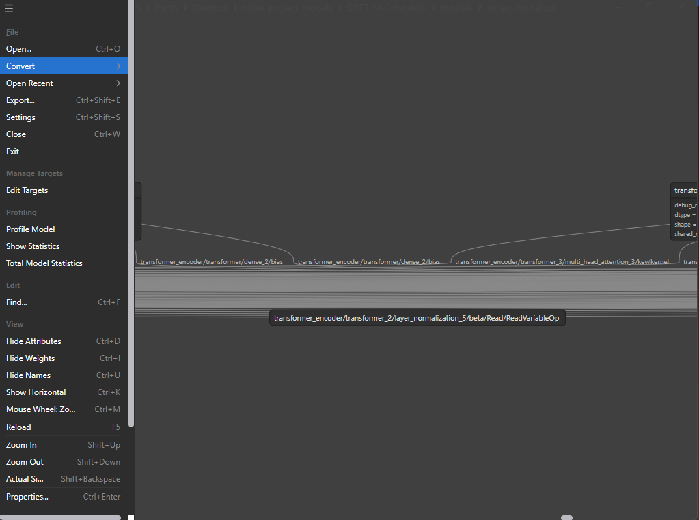
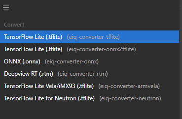
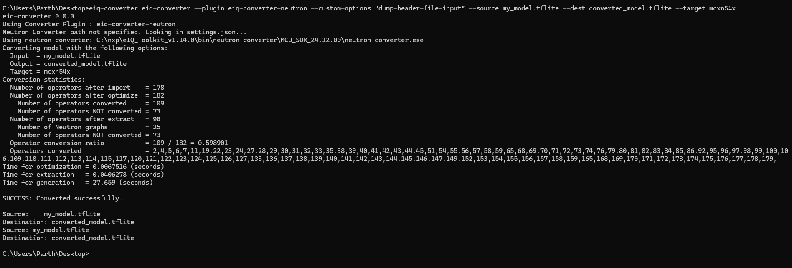

# Setup

- [eIQ Toolkit](https://www.nxp.com/design/design-center/software/eiq-ai-development-environment/eiq-toolkit-for-end-to-end-model-development-and-deployment:EIQ-TOOLKIT)

# Instructions for Quantising using eIQ Model Tool

1. Open eIQ Portal and select `Model Tool`



2. Open the model and visually inspect the model

3. On the top left, select the menu option `Convert



4. Select convert options `TensorFlow Lite`



5. Scroll down and check `Enable Quantization`

6. Select the following settings:
    - Conversion Quantisation Type: Per Channel
    - Input data type: uint8
    - Output data type: int8
    - Quantize Normalization: Signed


7. Click `Convert` and specify the output filename

# Instructions for eIQ Command Line to extract operators

1. Run the following command for the input file `target_quantised_tflite_model.tflite`: 
   - ```eiq-converter eiq-converter --plugin eiq-converter-neutron --custom-options "dump-header-file-input" --source target_quantised_tflite_model.tflite --dest model_neutron.tflite --target mcxn54x```



2. Delete `model_neutron.tflite`.

3. Examine the output header file and extract the operator files


- For ARM NPU, add the following operator: `s_microOpResolver.AddEthosU();`